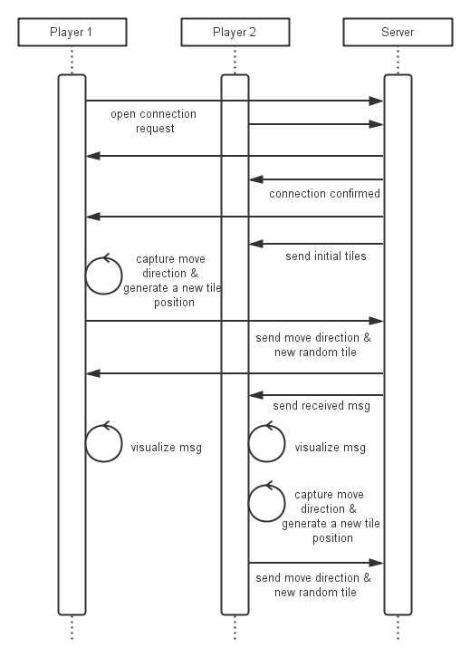

# 2048-Chess

	课程：高级Web技术
	内容：Lab1-HTML5
	姓名：干悦
	学号：11300180158
	项目地址：https://github.com/hermione521/2048-chess

## 项目背景

2048-Chess是因为最近非常流行的游戏[2048](http://gabrielecirulli.github.io/2048/)而产生的灵感，这个游戏最初是来源于收费的手机游戏[threes](http://asherv.com/threes/)，后来又出现了类似的免费手机游戏[1024](https://itunes.apple.com/us/app/1024!/id823499224)。

2048可能是由于其易上手却不易通关的特点迅速风靡，又由于它在GitHub上开源，各种改版层出不穷。其中Emils的[2048-multiplayer](http://emils.github.io/2048-multiplayer/)是一个双人对战版，它将随机的两人配对，两人分别玩自己的2048，先达到2048或者一定时间内得分高的玩家获胜。

## 技术背景

HTML5仍处在发展阶段，它是HTML的一个新版本，提供了更多能有效增强网络应用的标准集。当我们说HTML5时，我们通常是指广义的HTML5，它实际上包括了HTML、CSS和Javascript，希望通过浏览器直接支持来减少对插件（如Flash、Silverlight等）的需求。

HTML5主要包含了一些新元素（如\<nav\>、\<footer\>等）、实时二维绘图的Canvas API、三维绘图的WebGL、离线存储的Web Storage、浏览器与服务器间进行全双工通讯的WebSocket等。

在WebSocket之前，浏览器和服务器之间的通信采用轮训的HTTP Request，然而HTTP Request的请求头比较长，包含的数据可能很小，导致服务器资源和带宽的浪费。Comet使用了AJAX来完成双向通信，但是长连接仍然会造成资源的浪费。而在WebSocket中只要进行一次握手就可以建立双向通信，进行快速通信。

##项目概况

2048-Chess也是双人对战版，不同之处在于进行游戏的两人同时玩一个2048棋盘，并且是轮流地每人每次只走一步。它没有时间限制，达到2048或者无子可下时游戏结束，达到2048或者得分高的玩家获胜。采用下棋的游戏方式使得玩家可以给对方设置陷阱，增加了游戏的趣味性。

2048-Chess是在[gabrielecirulli 的 2048](https://github.com/gabrielecirulli/2048)和[emils 的 2048-multiplayer](https://github.com/EmilS/2048-multiplayer‎)的基础上完成的。后者使用了Javascript库SockJS来进行浏览器和服务器之间的通信，如果浏览器不支持 WebSocket，该库可以模拟对 WebSocket 的支持。

##开发环境

2048-Chess使用Node.js进行开发，用到了以下模块：

 - ws Websocket库
 - express 网页应用框架
 - node-uuid 生成全局唯一变量的库
 - node-redis Node的Redis客户端
 - winston 异步多重传输日志库

##主要结构

### Server结构
app.js

	app.js: server的基本功能
	·路由
	·配对玩家并开启GameLobby
	·监听clients发来的message

GameLobby

	GameLobby.js: 双人游戏房间内的功能
	·初始化房间
	·监听clients发来的message并做出处理（转发）

### Client结构

application.js

	application.js: client的基本功能
	·连接server
	·监听server发来的message并转发给相应模块

GameManager

	game_manager.js: 进行游戏的基本功能
	·初始化游戏
	·添加和移动方块（数据层面）
	·更新界面（转发给HTMLActuator）

KeyboardInputManager

	keyboard_input_manager.js: 处理本地键盘输入
	·读取本地键盘输入
	·将输入发送给server

OnlineInputManager

	online_input_manager.js: 处理server发来的输入
	·读取server发来的输入
	·转发给GameManager进行操作

Grid

	grid.js: 棋盘类
	·初始化棋盘
	·找到可以放置方块的位置
	·放置方块（数据层面）

Tile

	tile.js: 棋子类
	·保存棋子的前一个位置
	·更新棋子位置

HTMLActuator

	html_actuator.js: 直接修改html代码
	·更新棋盘
	·添加棋子

### 流程

下图是从玩家按下"find competitor"按钮开始，到第二次move结束的流程图：

其中涉及以下几点考虑：

1. 为了减轻服务器压力，生成棋子（方块）的工作只有第一次是在服务器端完成的，以后都交由玩家的浏览器完成。
2. 为了分离玩家操作和消息实现（绘图），并且提高作弊的难度，我们采用了两个InputManager：keyboardInputManager专门负责检测键盘输入并且发送消息给服务器，onlineInputManager专门负责接收消息（包括自己的操作和对方的操作）并且处理。
3. 为了防止作弊，玩家轮流操作的检测在服务器端进行。即使玩家发送了多个操作消息，服务器端也不进行转发。

## 展望
1. 未来可以考虑把server放到BAE或者OpenShift上，目前还不确定是否支持WebSocket；由于代码已经在GitHub上，可以很方便地把client放在GitPage上。
2. 可以考虑增加寻人功能，给每个用户一个较短的uuid，实现和特定的人玩游戏。
3. 可以考虑增加社交功能，分享对战结果到人人、微博等平台。